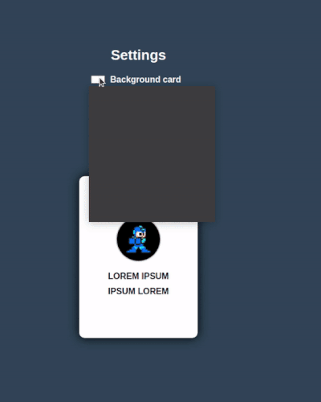

# React Context Api

Projeto desenvolvido para demonstrar como se aplica o Context Api dentro da sua aplicação ReactJs.
# <a href="https://reactcontexapi.netlify.app/" target="_blank">Clique aqui para ver o projeto em ação </a>

## O que foi utilizado

* ReactJs
* Styled Components
* Context Api

## Iniciar Projeto

<b>1º Clone esse repositório no seu computador ou baixe no formato (ZIP).</b>

<b>2º Abra o seu terminal e na raiz do projeto rode o comando `npm install` ou `yarn` para baixar todas as depêndencias do projeto.</b>

<b>3º Rode o comando `npm start` ou `yarn start`.</b>

# Desenvolvido por Gustavo Scarpim:

